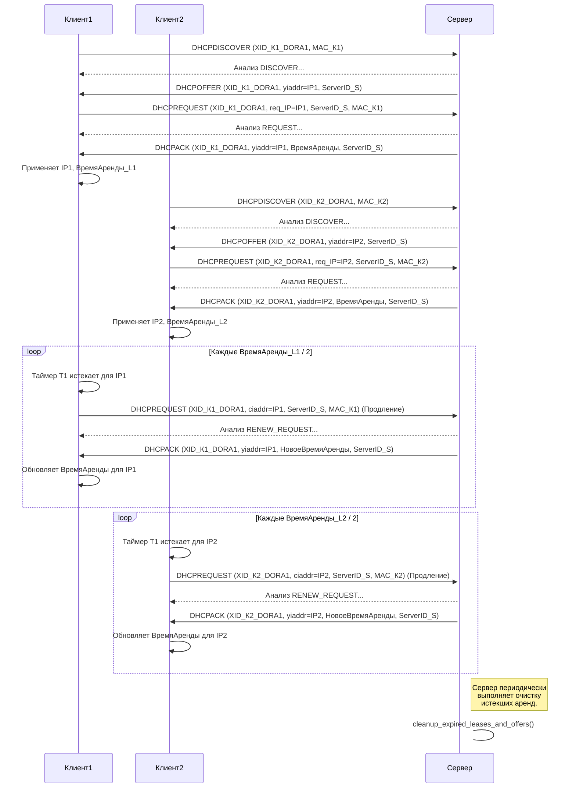

# **DHCP**

```mermaid
sequenceDiagram
  participant Клиент1 as Клиент1
  participant Клиент2 as Клиент2
  participant Сервер as Сервер

  Клиент1 ->>+ Сервер: DHCPDISCOVER (XID_К1_DORA1, MAC_К1)
  Сервер -->> Клиент1: Анализ DISCOVER...
  Сервер ->> Клиент1: DHCPOFFER (XID_К1_DORA1, yiaddr=IP1, ServerID_S)
  Клиент1 ->>+ Сервер: DHCPREQUEST (XID_К1_DORA1, req_IP=IP1, ServerID_S, MAC_К1)
  Сервер -->> Клиент1: Анализ REQUEST...
  Сервер ->> Клиент1: DHCPACK (XID_К1_DORA1, yiaddr=IP1, ВремяАренды, ServerID_S)
  Клиент1 ->> Клиент1: Применяет IP1, ВремяАренды_L1
  Клиент2 ->>+ Сервер: DHCPDISCOVER (XID_К2_DORA1, MAC_К2)
  Сервер -->> Клиент2: Анализ DISCOVER...
  Сервер ->> Клиент2: DHCPOFFER (XID_К2_DORA1, yiaddr=IP2, ServerID_S)
  Клиент2 ->>+ Сервер: DHCPREQUEST (XID_К2_DORA1, req_IP=IP2, ServerID_S, MAC_К2)
  Сервер -->> Клиент2: Анализ REQUEST...
  Сервер ->> Клиент2: DHCPACK (XID_К2_DORA1, yiaddr=IP2, ВремяАренды, ServerID_S)
  Клиент2 ->> Клиент2: Применяет IP2, ВремяАренды_L2
  loop Каждые ВремяАренды_L1 / 2
    Клиент1 ->> Клиент1: Таймер T1 истекает для IP1
    Клиент1 ->>+ Сервер: DHCPREQUEST (XID_К1_DORA1, ciaddr=IP1, ServerID_S, MAC_К1) (Продление)
    Сервер -->> Клиент1: Анализ RENEW_REQUEST...
    Сервер ->> Клиент1: DHCPACK (XID_К1_DORA1, yiaddr=IP1, НовоеВремяАренды, ServerID_S)
    Клиент1 ->> Клиент1: Обновляет ВремяАренды для IP1
  end
  loop Каждые ВремяАренды_L2 / 2
    Клиент2 ->> Клиент2: Таймер T1 истекает для IP2
    Клиент2 ->>+ Сервер: DHCPREQUEST (XID_К2_DORA1, ciaddr=IP2, ServerID_S, MAC_К2) (Продление)
    Сервер -->> Клиент2: Анализ RENEW_REQUEST...
    Сервер ->> Клиент2: DHCPACK (XID_К2_DORA1, yiaddr=IP2, НовоеВремяАренды, ServerID_S)
    Клиент2 ->> Клиент2: Обновляет ВремяАренды для IP2
  end
  Note right of Сервер: Сервер периодически<br/>выполняет очистку<br/>истекших аренд.
  Сервер -> Сервер: cleanup_expired_leases_and_offers()


```